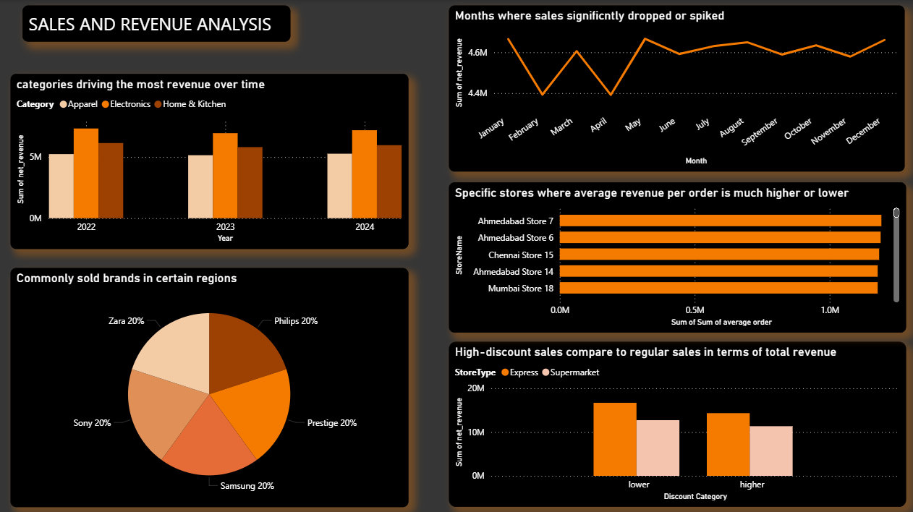
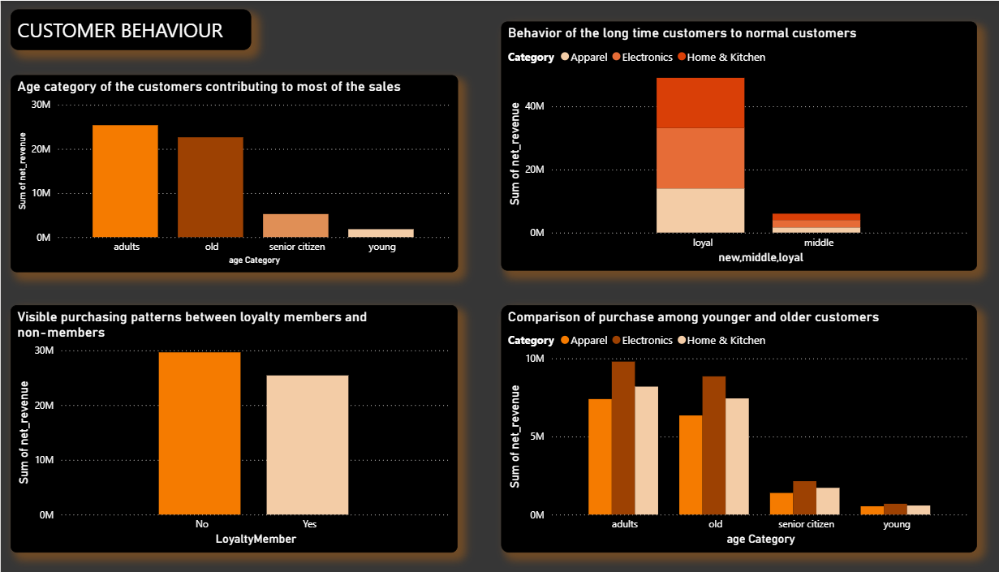
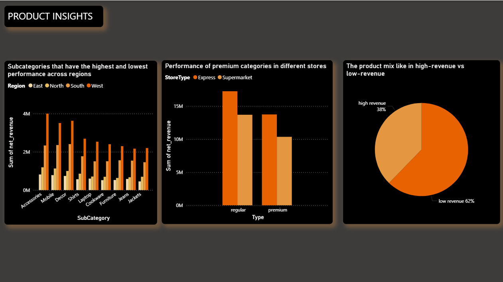
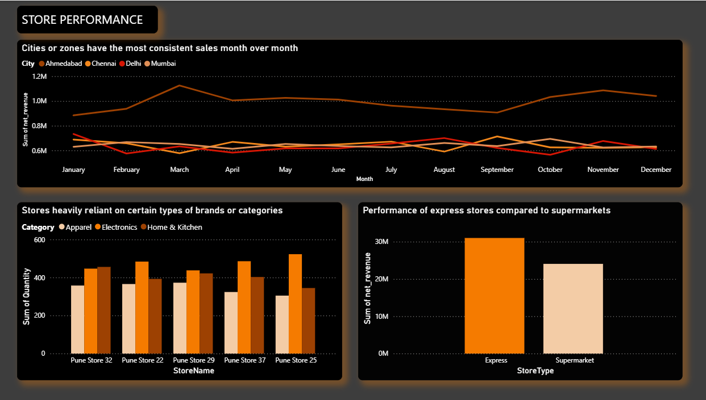
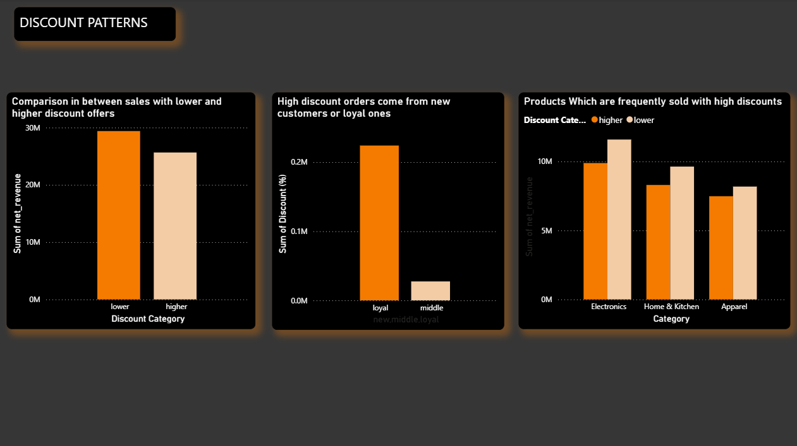
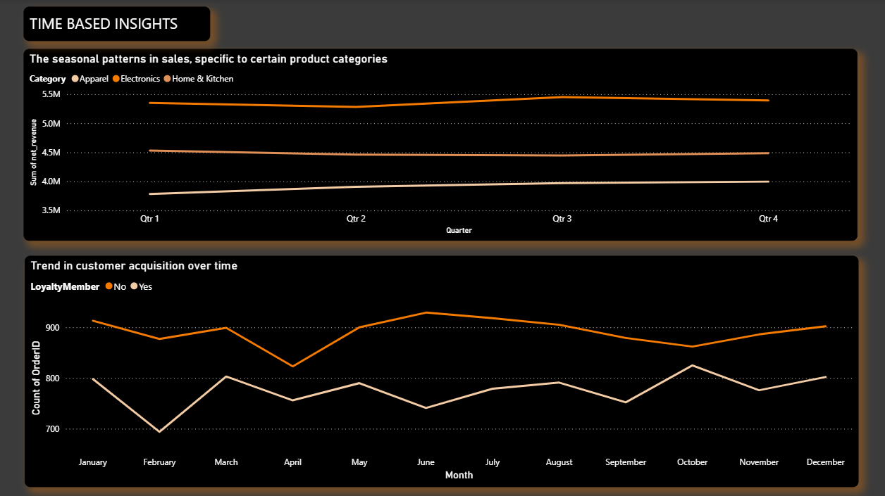

# 💼 Sales and Revenue Dashboard (Power BI)

## 📘 Overview
The **Sales and Revenue Dashboard** is an interactive business intelligence project built using **Power BI**.  
It provides an in-depth analysis of company sales, revenue growth, and performance across products, regions, and time periods.  

This project showcases data analytics and visualization capabilities to help organizations make **data-driven business decisions** through intuitive and dynamic insights.

---

## 🧠 Objective
- To track **sales and revenue performance** across regions and categories.  
- To visualize **KPIs** such as total revenue, profit margin, and sales growth.  
- To identify top-performing products, markets, and customer segments.  
- To build a professional dashboard suitable for business intelligence reporting and management decision-making.

---

## 🗂️ Dataset
- **Source:** [Kaggle – Superstore Sales Dataset](https://www.kaggle.com/) or a simulated sales dataset.  
- **Format:** CSV / Excel  
- **Attributes include:**
  - `Order ID`
  - `Order Date`
  - `Ship Date`
  - `Region`
  - `Category` / `Sub-Category`
  - `Product Name`
  - `Sales`
  - `Profit`
  - `Quantity`
  - `Discount`

---

## ⚙️ Tools & Technologies
- **Power BI Desktop** – for dashboard design and interactivity  
- **Microsoft Excel** – for data cleaning and formatting  
- **DAX (Data Analysis Expressions)** – for creating KPIs and calculated measures  
- **Kaggle / Custom Dataset** – used for analysis  

---

## 📊 Key Features & Visuals
- 💰 **KPI Cards:** Total Revenue, Profit, Sales Quantity, and Profit Margin.  
- 🏆 **Top Products & Categories:** Identify top and underperforming segments.  
- 🌍 **Regional Sales Overview:** Visualize sales by region and country using map visuals.  
- 📅 **Time-Series Analysis:** Track revenue trends month-over-month or year-over-year.  
- 🧾 **Category Breakdown:** Bar and pie charts showing sales by category/sub-category.  
- 📈 **Profitability Insights:** Interactive visuals highlighting profit and discount impact.  
- 🔍 **Dynamic Filters:** Filter by date, region, product, or category for focused analysis.

---

## 🧩 Dashboard Insights
- Revenue and profit growth trends reveal **seasonal spikes** and **regional performance gaps**.  
- Certain product categories contribute the **highest profit margins**, while others show losses due to high discounts.  
- The dashboard helps identify **sales opportunities** and **areas needing improvement** for business optimization.  
- Designed for **executive-level visualization**, making business monitoring faster and smarter.

---

## 🚀 How to Use
1. Clone or download this repository.  
2. Open the `.pbit` file in **Power BI Desktop**.  
3. Load your dataset (CSV or Excel).  
4. Refresh visuals to populate the dashboard with your data.  

---

## 🧰 Skills Demonstrated
- Data cleaning and transformation  
- DAX calculations and measures  
- KPI and performance visualization  
- Power BI dashboard design  
- Business intelligence reporting  
- Data storytelling and insights presentation  

---

## 📸 Dashboard Preview

*(The above images are actual screenshot from the Power BI dashboard.)*

---

## 📚 Future Improvements
- Integration with **live sales databases** for real-time monitoring.  
- Adding **forecasting models** using Power BI predictive analytics.  
- Creating a **mobile-responsive version** of the dashboard.  

---

## 👨‍💻 Author
**Sai Kumar Reddy N**  
📧 Email: [saimanikya8152@gmail.com.com]  
💼 [LinkedIn Profile](https://linkedin.com/in/thesaireddy20)  
💻 [GitHub Profile](https://github.com/thesaireddy20)

---

## 🏷️ Tags
`#PowerBI` `#SalesDashboard` `#RevenueAnalysis` `#DataAnalytics` `#BusinessIntelligence` `#Visualization` `#SaiKumarReddyN`
